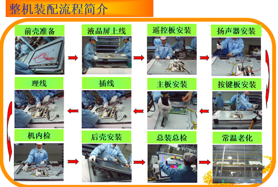

# 电视装配线生产日志数据集-TV-ALP


<div align="center"> 

## 🌐项目简介

电视装配线生产日志数据集（TV-ALP）全面记录了电视机流水线制造过程，包含多模态数据，如生产过程中的图像数据、文本日志等。该数据集支持多种应用场景，包括目标检测、流程挖掘、预测性流程监控等。目前，项目团队正在积极筹备并标注与制造过程监控相关的视频数据集。

- 整机装配流程

  

- 电视机流水线制造流程样例图

  

- 作者指导书


## 🧭实验结果

除了进行常规的统计性质量检查，本研究还将TV-ALP在多种计算机视觉任务和预测性流程监控任务其他公开数据集进行了基准测试与比较，提供了基准性能指标作为参考。TV-ALP的数据种类以及数量也在持续更新完善。


## 免责声明

本项目提供的电视装配线生产日志数据集基于特定生产环境和设备记录生成，但数据集可能存在一定程度的偏差、不完整性或错误信息。因此，该数据集仅供参考和研究使用，不保证其绝对准确性、完整性或适用性。使用该数据集进行分析、建模或其他研究活动所产生的结果可能存在误差或偏差，不可直接用于实际生产或决策。本项目不对因使用数据集而产生的任何后果或损失承担责任。使用者在使用数据集时应自行承担风险，并对数据及研究结果进行必要的验证与校验。


## 引用

如果你使用了本项目的数据或者代码，请声明引用

```latex
@article{zou2024tv,
  title={TV-ALP: A log dataset of television assembly line production under multi-person collaboration for process mining research},
  author={Zou, Minghao and Zeng, Qingtian and Duan, Hua and Ni, Weijian and Chen, Shuang},
  journal={Applied Intelligence},
  volume={54},
  number={5},
  pages={3990--4011},
  year={2024},
  publisher={Springer}
}
@article{zou2024prediction,
  title={Prediction of Remaining Execution Time of Business Processes With Multiperson Collaboration in Assembly Line Production},
  author={Zou, Minghao and Zeng, Qingtian and Liu, Cong and Cao, Rui and Chen, Shuang and Zhao, Ziqi},
  journal={IEEE Transactions on Computational Social Systems},
  year={2024},
  publisher={IEEE}
}
```

